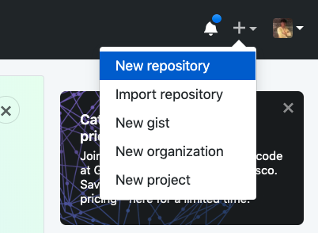
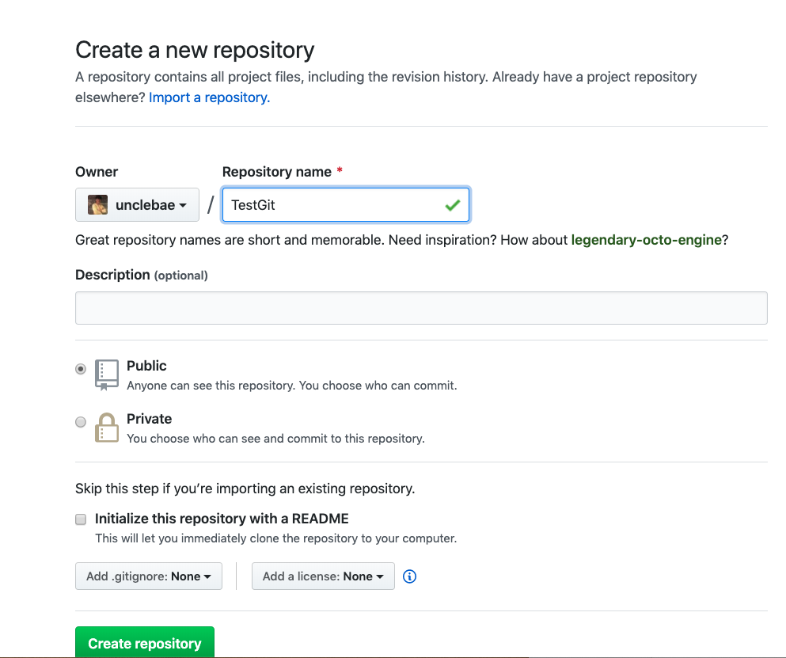
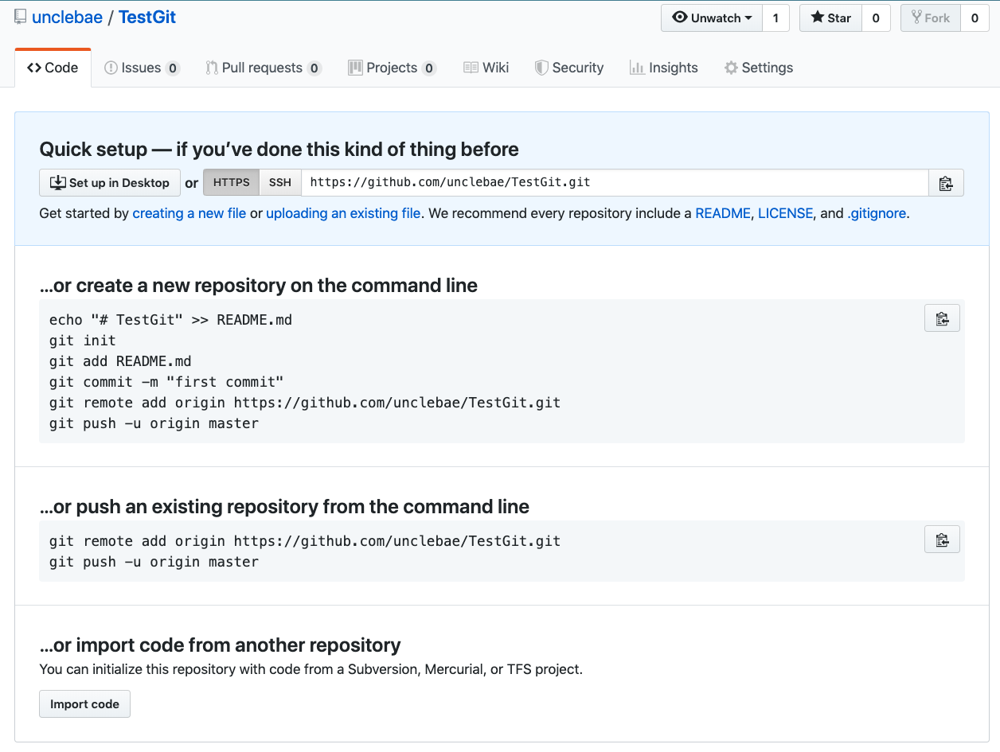

# Git Clone

Git 은 분산 버젼 컨트롤 시스템이라고 했습니다.

그리고 일반적으로 Git 사용하는 주된 이유는 함께 프로젝트를 수행하는 동료들과 함께 협업을 위해 사용합니다.

이럴때 공통의 원격지 네트워크에 존재하는 Repository 가 있으며, 이러한 리포지토리에서 프로젝트 리소스를 클론 할 수 있습니다.

## 원격 리포지토리 생성하기.

우선 https://github.com 에 우선 가입합니다. 그리고 Repository 를 생성하빈다.

### 리포지토리 생성



이렇게 리포지토리를 생성합니다.

### 리포지토리 이름 지정하기



프로젝트 이름을 지정해 줍니다.

github 을 유료로 사용하면, private 프로젝트를 생성할 수 있습니다.

### 리포지토리 준비 커맨드 살펴보기.



## 로컬 Repository 생성하고 원격 디렉토리 연동하기.

```
mkdir testGit
cd testGit

echo "# TestGit" >> README.md
git init
git add README.md
git commit -m "first commit"
git remote add origin https://github.com/unclebae/TestGit.git
git push -u origin master
```

보시는바와 같이 특정 디렉토리로 이동합니다.

그리고는 README.md 파일을 만듭니다. 이 파일은 리포지토리에 접근하면 가장 먼저 나타나는 markdown 형식의 문서 입니다.

대략적으로 프로젝트의 설명등을 기술하게 됩니다.

`git init`: 이 명령은 이전에 보았듯이 해당 디렉토리를 로컬 리포지토리로 초기화 합니다.
`git add README.md`: 이 명령어는 README.md 라는 파일을 스테이지 상태로 만듭니다. (즉, git 관리하는 파일로 만듭니다.)
`git commit -m "first commit"`: 커밋은 로컬 리포지토리에 파일의 변경 내용을 저장합니다. 저장이 된 이후 버젼 관리가 됩니다.
`git remote add origin ....`: 이 명령어는 원격지와 로컬을 연동하는 역할을 합니다.
`git push -u origin master`: 로컬의 변경되는 파일을 리모트 리포지토리로 푸시합니다. -u 옵션은 특정 브렌치로 푸시를 할 수 있는 기능입니다. origin 은 remote 를 등록할때 origin 이라고 리모트 저장소를 가리키는 이름입니다.
즉, 위 명령어는 origin 이라는 리모트 리포지토리에서 master 라는 브렌치로 푸쉬한다는 의미입니다.

## Git clone 수행하기.

이제 Git clone 을 수행해보겠습니다.
위 이미지에서 보시는바와 같이 URL 을 복사합니다.

그리고 다음과 같이 수행합니다.

```
mkdir testGit
cd testGit

git clone https://github.com/unclebae/TestGit.git
or
git clone https://github.com/unclebae/TestGit.git yourtest
```

이라고 하면 testGit 내부에 TestGit 이라는 디렉토리로 생성이 됩니다.

git clone <url> <localDirectory> 로 직접 리포지토리와 로컬 리포지토리를 지정해 줄 수 있습니다.

## 특정 브렌치나, 태그를 체크아웃 하기.

일반적으로 이전 명령은 바로 git 의 마스터 브렌치를 기본으로 해서 클론을 받습니다.

그러나 필요한경우 다양한 브렌치나, 태그를 별도로 클론을 받을 수 있습니다.

```
git clone -branch <tag> <branch>
```

위와 같이 특정 태그나 브렌치를 둘 수 있습니다.

태그는 Git history 의 특정 포인트에 태그를 기재하는 것입니다.

일반적으로 태그는 릴리즈 브렌치를 태깅하고, 해당 브렌치가 프로덕트로 빌드 > 배포 나갈 수 있도록 달아주는데 사용합니다.

이것 이외에도 특별히 브렌치를 태깅하고, 이후 빠르게 참고할 수 있도록 하기 위해서 사용할 수 있습니다.

## Swallow cloning

git clone 은 지금까지 나온 git history 를 모두 로컬로 복제해오는 것입니다.

이렇게 git history 를 로컬에 모두 가져오면, 우리는 git 이력을 바탕으로 마음껏 브렌치, 버젼을 이동하며 소스를 확인할 수 있습니다 .

```
git clone -depth=1 <repo>
```

이것은 -depth=1 과 같이 이력을 깊이 1의 값만을 로컬로 클로닝 합니다.

보통 잘 사용하지 않으며, 정말 git 이력이 너무 많아서 클로닝시 시간이 많이 소요가 된다면, 장점을 얻을 수 있습니다.

# 결론

Git clone 은 원격지의 프로젝트 소스를 클로닝을 할 수 있습니다.

클론을 받은 이후로 부터 로컬 리포지토리에서 다양한 소스 작업을 할 수 있고, 이후 git add, git commit, git push 를 통해서 서버 리포지토리에 소스를 업로드 할 수 있습니다.
