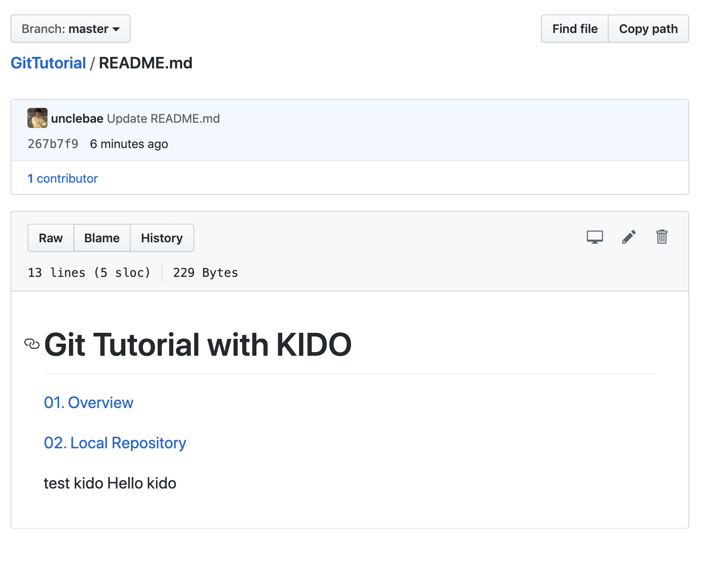
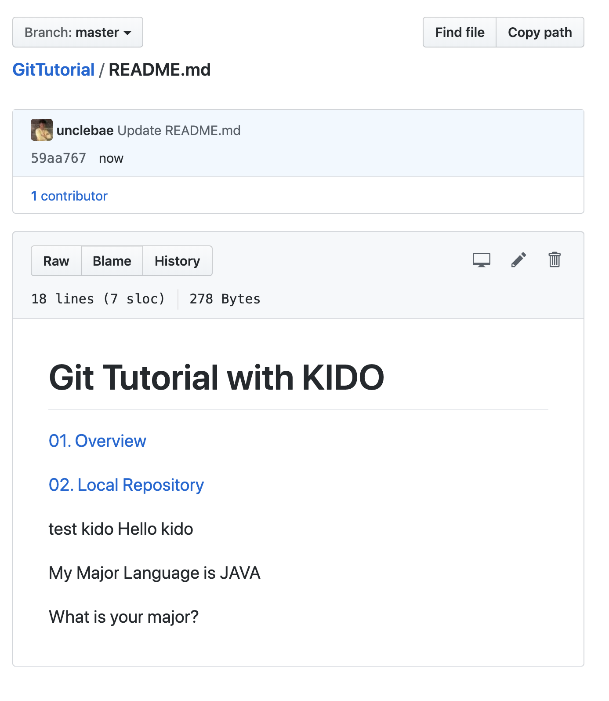

# Git Pull Fetch

Git remote 와 연동하였으니 이제는 remote repository 에서 소스를 가져오는 방법에 대해서 알아보고자 합니다.

## git fetch

git fetch <remote_name> <branch>

위 방식으로 fetch 를 수행하면 로컬에 원격지 브렌치를 로컬로 복제해 옵니다.

이때 복제만 수행하며, fetch 소스는 머지되지 않습니다.

복제된 포인트는 FETCH_HEAD 가 됩니다.

이제 어떻게 되는지 한번 알아보겠습니다.

### 원격지 소스에서 파일 부분 변경하기.



위와같이 소스를 변경합니다.

### master branch fetch 해오기

그리고 Local master 브렌치로 이동합니다.

```
git checkout master

git fetch origin master
From https://github.com/unclebae/GitTutorial
 * branch            master     -> FETCH_HEAD
```

fetch 를 하게 되면 위 예제에서 보는바와 같이 FETCH_HEAD 에 패치 됩니다.

### FETCH 된 내역 살펴보기.

```
git log FETCH_HEAD

commit 267b7f9c7ab106587a71d51cc11955560dfb3cb8 (origin/master)
Author: 엉클배(배기도) <baekido@gmail.com>
Date:   Mon Sep 16 14:44:43 2019 +0900

    Update README.md

commit 1016c3f7a419f8d870934b567a616a4bc66b5305 (HEAD -> master)
Author: kido <baekido@gmail.com>
Date:   Wed Sep 11 13:37:36 2019 +0900

    add remote show

commit 503e1af6fee06edaf3c23c403d8ffe8b47c9c5ad
Author: kido <baekido@gmail.com>
Date:   Wed Sep 11 13:09:43 2019 +0900

    git remote

```

보시는 바와 같이 origin/master 의 FETCH_HEAD 정보와 이전 로그는 HEAD --> master 로 마스터 헤드를 가리키고 있습니다.

일반적으로 git log 를 수행하면 local HEAD 의 소스만 포인팅 하고 있습니다.

그러므로 패이된 버젼을 확인하고자 한다면 FETCH_HEAD 를 확인해야합니다.

```
git log

commit 1016c3f7a419f8d870934b567a616a4bc66b5305 (HEAD -> master)
Author: kido <baekido@gmail.com>
Date:   Wed Sep 11 13:37:36 2019 +0900

    add remote show

commit 503e1af6fee06edaf3c23c403d8ffe8b47c9c5ad
Author: kido <baekido@gmail.com>
Date:   Wed Sep 11 13:09:43 2019 +0900

    git remote

commit 91d5c493cde1bc006c091d21682b642bd57593a8
Author: kido <baekido@gmail.com>
Date:   Wed Sep 11 09:33:00 2019 +0900

    add git workflow
```

### fetch 받아온 내역을 머지하기.

```
git merge origin/master

Updating 1016c3f..267b7f9
Fast-forward
 README.md | 8 ++++++++
 1 file changed, 8 insertions(+)
```

위와같이 머지를 수행했습니다.

```
git log
commit 267b7f9c7ab106587a71d51cc11955560dfb3cb8 (HEAD -> master, origin/master)
Author: 엉클배(배기도) <baekido@gmail.com>
Date:   Mon Sep 16 14:44:43 2019 +0900

    Update README.md

commit 1016c3f7a419f8d870934b567a616a4bc66b5305
Author: SKT.배기도 <baekido@gmail.com>
Date:   Wed Sep 11 13:37:36 2019 +0900

    add remote show

commit 503e1af6fee06edaf3c23c403d8ffe8b47c9c5ad
Author: SKT.배기도 <baekido@gmail.com>
Date:   Wed Sep 11 13:09:43 2019 +0900

    git remote

```

보시는 바와 같이 머지가 되었습니다.

HEAD -> master, origin/master 이 동일한 소스를 포인팅 하고 있습니다.

## Pull 하기

Pull 은 fetch 와 동일하게 원격지 소스를 가져옵니다.

단지 한가지 더 일을 하는것이 merge 를 동시에 수행합니다.

### 다시 서버의 내역을 수정하기



위와 같이 수정을 했습니다.

### Pull 해오기

```
git pull <remote_name> <branch>
```

master 를 수정했으니 master 를 pull 해 오겠습니다.

```
git pull origin master

From https://github.com/unclebae/GitTutorial
 * branch            master     -> FETCH_HEAD
Updating 267b7f9..59aa767
Fast-forward
 README.md | 5 +++++
```

보시는 바와 같이 pull 을 가져왔습니다.

자세한 내역을 살펴보면 FETCH_HEAD 가 보이는 것으봐서 Fetch 먼저 해오고, 머지를 수행했다는 것을 확인할 수 있습니다.

```
git log

commit 59aa767e986f38397e384c53fc7a3bd1012c9d3c (HEAD -> master, origin/master)
Author: 엉클배(배기도) <baekido@gmail.com>
Date:   Mon Sep 16 15:15:45 2019 +0900

    Update README.md

commit 267b7f9c7ab106587a71d51cc11955560dfb3cb8
Author: 엉클배(배기도) <baekido@gmail.com>
Date:   Mon Sep 16 14:44:43 2019 +0900

    Update README.md

commit 1016c3f7a419f8d870934b567a616a4bc66b5305
Author: SKT.배기도 <skt.1111489@sk.com>
Date:   Wed Sep 11 13:37:36 2019 +0900

    add remote show
```

실제 로그를 확인하면 fetch, merge 를 수행한 결과임을 바로 확인할 수 있습니다.

(HEAD -> master, origin/master) 로 되어 있기 때문이죠?

# 결론

지금까지 Fetch, Pull, merge 를 살펴 보았습니다.

일반적으로 pull 으로 많이 이용하며, 바로 머지가 되면 안되는 케이스에 대해서 fetch 를 수행한 다음 merge 를 수행합니다.

두 명령어 모두 머지하느냐에 차이지만, 안전하게 git 을 이용하기 위해서 사용하는 것을 이해하면 될듯 합니다.
