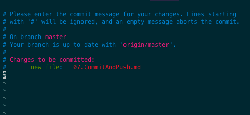
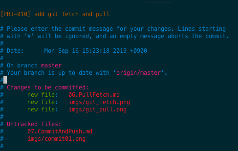

# Commit and Push

지금까지 Commit 은 계속 작업해 왔습니다. 

이번에는 Commit 옵션을 확인해보고, Remote Repository 에 Push 를 통해서 반영하는 작업을 알아보겠습니다. 

## Commit

Git 은 우선 로컬에서 소스코드를 작업하고, 로컬 리포지토리에 커밋을 통해 저장합니다. 

과정은 이전 아티클에서 살펴본바와 같이 다음과 같은 방식으로 처리됩니다. 

Untracked File 생성 >> git add . (Stage 상태로 변경, git 관리 파일로 등록) >> git commit (로컬 리포지토리에 저장)

위 과정을 통해서 수정된 파일을 로컬 리포지토리에 반영합니다. 

### Commit 

```
> git commit 
```

staged 상태의 파일이 있다면 에디터가 타나납니다. 

staged 상태 파일이 없다면 다음과 같이 나타납니다. 

```
> git commit

On branch master
Your branch is up to date with 'origin/master'.

Untracked files:
        07.CommitAndPush.md

nothing added to commit but untracked files present
```

- 위 내용을 보면 마스터 브렌치에서 작업을 알려줍니다. 
- 브렌치내에 Untracked files 가 있습니다. (새로만든 파일이지요)
- 그리고 staged 파일이 없으므로 위와같이 커밋할 내용이 없다는 메시지를 나타냅니다. 

```
> git add .
> git commit

```

이렇게 stage 상태로 만들어주면 다음과 같이 vi 에디터가 나타납니다. 



위 화면에서 커밋할 커멘트를 등록하고 'ESC' + w + q 하고 저장해주면, 로컬에 저장됩니다. 

### commit -a 옵션 

-a 옵션을 수행하면 tracked 된 파일들을 기준으로 변경(수정,삭제)된 파일을 stage로 만들고 위와 같이 바로 커밋을 위한 에디터가 오픈됩니다. 

```
> git commit -a 
or
> git commit --all
```
위와 같이 옵션을 사용할 수 있습니다. 

### commit -m 으로 메시지 남기기 

커밋을 할때 명령어와 동시에 커밋 메시지를 남기고자 한다면 -m 옵션을 이용할 수 있습니다. 

```
> git commit -m "add document of commit"
or
> git commit --message "add document of commit"
```

동시에 stage 로 만들고 커밋 메시지를 남기고자 한다면 

```
> git commit -am "add document of commit"
```

### commit --amend 로 바로전 커밋메시지 수정하기. 

amend 는 개정이라는 의미입니다. 즉, 이전 커밋의 메시지를 개정하는 경우 사용합니다. 

개정의 경우 commit 할때 특정 패턴을 인식해서, 마스터 브렌치에 머지하지 못하게 하는경우 특정 제약조건을 걸 수 있습니다. 

이럴때 커밋 메시지를 잘못 작성하면 해당 커밋은 원격 리포지토리에 반영이 안될 수 있습니다. 

이때 --amend 를 이용하여 형식에 맞게 수정할 수 있습니다. 

```
> git log

commit ab1983d2ddcacb35c83cfa0558f9150085a1fb54 (HEAD -> master, origin/master)
Author: kido <baekido@gmail.com>
Date:   Mon Sep 16 15:23:18 2019 +0900

    add git fetch and pull

commit 59aa767e986f38397e384c53fc7a3bd1012c9d3c
Author: 엉클배(배기도) <baekido@gmail.com>
Date:   Mon Sep 16 15:15:45 2019 +0900

    Update README.md
```

위와 같은 로그가 있다고 해 봅시다. 마지막 커밋 로그는 'add git fetch and pull' 이라고 되어 있습니다. 

이 메시지를 다음과 같이 바꿔 보겠습니다. '[PRJ-010] add git fetch adn pull' 이 우리가 바꾸고자 하는 메시지 입니다. 

```
> git commit --amend

```

명령어를 입력하면 아래와 같이 수정가능한 화면으로 이동합니다. 



위와같이 메시지를 입력하고 `ESC + w + q` 를 해주면  아래와 같은 메시지가 나옵니다 

```
[master c3a25a2] [PRJ-010] add git fetch and pull
 Date: Mon Sep 16 15:23:18 2019 +0900
 3 files changed, 195 insertions(+)
 create mode 100644 06.PullFetch.md
 create mode 100644 imgs/git_fetch.png
 create mode 100644 imgs/git_pull.png

> git log

commit c3a25a2c026857b69d3273f43fa721d2e540b556 (HEAD -> master)
Author: kido <baekido@gmail.com>
Date:   Mon Sep 16 15:23:18 2019 +0900

    [PRJ-010] add git fetch and pull

commit 59aa767e986f38397e384c53fc7a3bd1012c9d3c
Author: 엉클배(배기도) <baekido@gmail.com>
Date:   Mon Sep 16 15:15:45 2019 +0900

    Update README.md
```

위화면과 같이 커밋 메시지가 변경된 것을 확인할 수 있습니다. 


## Push 하기

로컬 리포지토리에 커밋을 하였으니 이제는 서버에 커밋본을 서버로 반영하는 일이 남았습니다. 

이때 사용하는 커맨드가 git push 입니다. 

### git push 로 푸시하기

이 명령어는 현재 브렌치에서 원격지 origin 브렌치로 커밋 이력을 푸시 합니다. 

원격지의 커밋을 변경하게 되는 경우에는 Git 은 커밋을 하지 못하게 막습니다. 그러나 새로운 커밋이라면 원격지 리포지토리에 정상적으로 커밋을 할 수 있습니다. 

```
> git push

To https://github.com/unclebae/GitTutorial.git
 ! [rejected]        master -> master (non-fast-forward)
error: failed to push some refs to 'https://github.com/unclebae/GitTutorial.git'
hint: Updates were rejected because the tip of your current branch is behind
hint: its remote counterpart. Integrate the remote changes (e.g.
hint: 'git pull ...') before pushing again.
hint: See the 'Note about fast-forwards' in 'git push --help' for details.
```

위와 같이 push 가 실패 되었습니다. 

원격지의 리포지토리 내역과 로컬 리포지토리 내역이 서로 다르기 때문입니다. 

### git push --force 로 강제로 푸시하기. 

--force 를 이용하면 로컬 커밋 내역을 강제로 서버로 보냅니다. 

그러나 이렇게 --force 를 보내는 것은 로컬의 변경사항을 서버로 강제로 오버라이트 하는 것이기 때문에 확실하지 않은경우라면 바로 이용하면 안됩니다. 

```
> git push --force

Enumerating objects: 14, done.
Counting objects: 100% (14/14), done.
Delta compression using up to 8 threads
Compressing objects: 100% (11/11), done.
Writing objects: 100% (12/12), 338.13 KiB | 16.91 MiB/s, done.
Total 12 (delta 3), reused 0 (delta 0)
remote: Resolving deltas: 100% (3/3), completed with 1 local object.
To https://github.com/unclebae/GitTutorial.git
 + ab1983d...c2adc6b master -> master (forced update)
```

강제로 push 해봤습니다. 

가장 마지막 라인에 forced update 라고 되어 있습니다. 