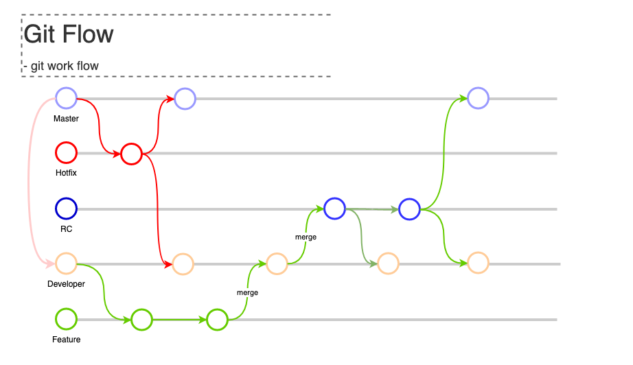

# Git Flow

git workflow 는 다양하게 있습니다. 

그 중에서도 가장 인기가 많은 git flow 에 대해서 오늘 살펴볼 예정입니다. 

## git workflow 

git 을 사용하여 협업을 할 때에 팀원들간에 룰을 정하고, 정해진 룰에 따라 소스를 관리하는 것이 성공적인 소스 관리를 위한 첫걸음 일 것입니다. 

자기 마음대로 브랜치를 따고, 머지를 해 버린다면, 원하지 않은 미완성의 기능이 운영 서버에 반영 장애를 일으키거나, 

누군가의 잘못된 소스가 원격 리포지토리에 반영이 되어, 심각한 문제를 발생 시킬 수 있습니다. 

이럴때 필요한 것이 workflow 정책입니다. 

## git flow 

workflow 는 다양하지만, 그 중에서 많은 개발자들에게 인기 있는 워크플로우가 바로 git flow 입니다. 

위 그림은 git flow 를 전체적으로 살펴 볼 수 있는 도식입니다. 

## git flow 의 구성

git flow 는 위 그림과 같이 5가지 카네고리 브랜치를 가지고 있습니다. 

- master branch: 마스터브랜치는 안정적인 소스만을 관리하는 브랜치입니다. 마스터는 완젼하게 안정된 소스 입니다 .
- develop branch: 개발 브랜치는 실제로 feature 를 따거나, rc 를 딸때 기준이 되는 브랜치입니다. 작업 브랜치 입니다. 
- rc branch: rc 는 release candidate 의 의미로, 실제 운영 환경에 반영될 수 있는 브랜치입니다. 실제 서버에 배포할때 rc를 통해 수행합니다. 
- feature branch: feature 브랜치는 dev 로 부터 따며, 각 개발자가 수행해야할 기능들을 개발하기 위해서 따는 브랜치엡니다. 이는 dev 에 반영되어 테스틀 수행합니다. 
- hot fix branch: 핫 픽스는 운영 서버에 반영된 최신의 마스터 브랜치로 부터 새롭게 따고, 핫픽스를 수행하는 브랜치입니다. 긴급하게 수정해야할 경우 주료 이용됩니다. 

위와같이 5개의 카테고리 브랜치를 두고, 소스관리를 하면 안전하게 운영 서버를 관리할 수 있고, 각 브랜치들이 서로 꼬이지 않게 작업을 할 수 있습니다. 

혹 누군가가 dev 브랜체를 망치거나 하더라도 rc 와 master 로 부터 특정 시점까지 롤백도 할 수 있기 때문에 많은 이점이 있습니다. 

## feature 작업시 워크플로우 살펴보기. 

새로운 기능을 추가해야하는 미션이 생겼다고 해봅시다. 맨 먼저 해야할 일은 해당 작업의 스토리를 작성하고, dev 브랜치에서 feature 브랜치를 작업명으로 하나 따는것입니다. 

다음과 같은 작업 순으로 처리 됩니다. 

1. 새롭개 배포할 특정 날짜? 혹은 배포 로드맵에 따라 RC 브랜치를 dev 로 부터 땁니다. 
2. dev --> feature XXX 로 브랜치 따기. 
3. feature XXX 에서 신규 개발을 수행하고, 테스트를 거칩니다. (이 과정에서 몇번의 로컬 커밋이 발생합니다.)
4. 기능 테스트가 완료된 소스를 dev 브랜치로 머지 합니다. 
5. 테스트 서버에서 dev 소스를 기준으로 QA 를 수행합니다. 
6. 이 작업이 완료되면 RC 브랜치로 머지 합니다. 그리고 Stage 서버에 배포를 하고, 테스트를 수행합니다. 
7. 스테이징 서버에서 QA 를 완료하였다면, RC 버젼으로 리얼 서버에 배포를 수행합니다. 
8. 리얼 배포가 완료되고, 모니터링에 문제가 없다면 RC 브랜치를 마스터와 dev 에 머지 시켜서 최신소스를 유지합니다. 

### 리얼 서버 문제 발생시. 

보통 RC 배포를 수행하고 리얼 서버에서 문제가 발생하면 3가지 시나리오로 롤백을 합니다 .

- 마스터 브랜치를 이용하여 CI/CD 를 수행합니다. 
- 이전 배포된 RC 브랜치의 태깅을 체크아웃 받아서 CI/CD 를 수행합니다. 
- 긴급 롤백사항이 아니라면 마스터에서 hotfix 를 따서 수정 배포 합니다. 

지금까지 feature 작업을 수행하는 방법을 살펴 보았습니다. 

## hotfix 처리하기. 

리얼 서버에 방금 배포 했는데 문제가 생겼다면 롤백이 최선의 방법입니다. 

그러나, 항상 롤백을 할 수 있는 것은 아닙니다. 특정 시간이 지나고나서, 가벼운 핫픽스를 수행하는 경우라면 롤백보다는 핫픽스 작업을 수행하는 것이 좋습니다. 

또한 롤백 자체가 불가능한 의존성이 있는 배포가 있었다면, 핫픽스가 최선의 방법이 됩니다. 

핫픽스는 다음과 같치 수행됩니다. 

1. master --> hotfix XXX 으로 브랜치를 땁니다. 
2. 핫픽스 작업을 수행합니다. 
3. 수행된 핫픽스 처리소스를 테스트 하고, 스테이징 서버에서 QA 를 진행합니다. 
4. 리얼 서버에 핫픽스를 배포하고나서, 모니터링을 합니다. 
5. 핫픽스 처리 브랜체를 master, dev 에 반영합니다. RC 가 미리 따져있다면 (다음 배포를 위해) RC 에도 반영합니다. 

핫픽스는 실제 리얼서버로 바로 반영이 되기 때문에 단위테스트, Stage 테스트만 가능하므로, 큰 변경이 있다면 수행이 어렵습니다. 

# 결론

지금까지 Git flow 에 대해서 알아 보았습니다. 

저의 경우 Git flow 를 그대로 이용하기보다 팀의 공통의 합의를 통해서 변형된 형태로 사용하는 경우가 많았습니다. 

rc 를 dev 서 따지않고, 리얼 배포를 수행할때 master 에 따고, 태그를 달아준다음 스태이징 배포를 하고, 리얼 배포를 하기도 했습니다. 

무엇보다 git flow 와 같은 workflow 는 팀이 모두 동일한 규칙을 이해하고 따르는게 핵심입니다. 그러기 위해서 교육도 필요합니다.
 